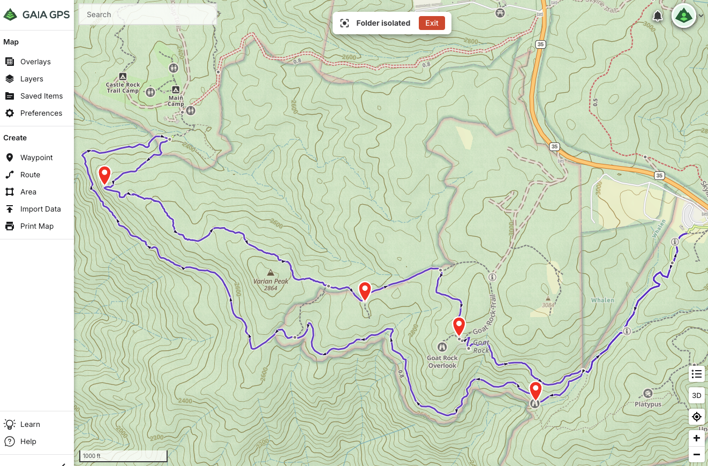

# CoursePointer

A command-line tool that converts GPX routes/tracks and waypoints into Garmin
FIT course files with "course points". This allows your waypoints to appear in
lists of upcoming points, including distance and time remaining, when
navigating on Garmin devices like Fenix watches and Edge bicycle computers.

## Usage example

Suppose you're planning a hiking route on [Gaia GPS](https://gaiagps.com/). In
addition to the route itself, you might have identified several points of
interest that you've saved as "waypoints":

## Development

See [docs/development.md](docs/development.md).
