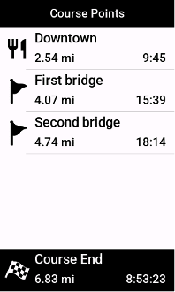
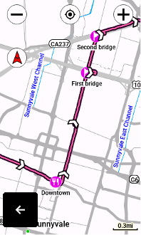

# CoursePointer

A command-line tool that converts waypoints from GPX files into "course points" in Garmin FIT course files. This allows them to appear in lists of upcoming points, displaying distance/time remaining, when navigating on devices like Garmin Edge bicycle computers or Garmin Fenix watches.

## Use cases

TODO

## Geographic calculations

In contrast with GPX files, FIT course files encode distances between "records" (equivalent to route points or track points), and crucially, the distance at which course points appear along the overall course. Without that latter field, course points won't work as expected on a device like a Garmin Edge bike computer.

To convert a GPX route or track with waypoints into a FIT course file with functional course points, we need to solve two geodesic problems to get additional data to include in the FIT output:

1. The *Inverse Problem*: Given two coordinates on the WGS84 ellipsoid (the Earth model used for GPS), what's the geodesic distance between them?
2. The *Interception Problem*: Given a geodesic segment and a target point, at what point along the geodesic is it nearest to the target?

Solutions of the inverse problem are used to compute the incremental distance between consecutive course records, for instance. This is implemented in Karney's C++ version of GeographicLib, which we wrap with cxx_build.

GeographicLib does not implement a solution to the interception problem, but it provides primitives we can build on top of.

TODO: More about the interception problem

## Development

It's a Rust command-line tool—with integration tests written in Python, in order to use [Garmin's FIT SDK for Python](https://pypi.org/project/garmin-fit-sdk/) as a reference implementation for FIT encoding.

This git repo includes GeographicLib as a submodule, so after checking it out you also need to do:

```
git submodule init
git submodule update
```

To run a locally-built version of the program, invoke `cargo run` from within the coursepointer-cli subdirectory. Run unit tests with `cargo test` in the top-level checkout directory.

To run integration tests, install [uv](https://docs.astral.sh/uv/) and then run

```
uv run --package integration pytest
```

from the checkout directory.

## FAQ

### Why is this tool even needed?

First, we have to understand that a modern Garmin Edge device, like the 1040, has two different representations of points of interest along a course.  Course points show up on the map when navigating a course and, most helpfully, in a dedicated data screen that lists them in order with the remaining distance and predicted time to each:





Saved locations, meanwhile, are saved "globally" on the device—that is to say, not within the context of navigating a specific course.  These will appear on the map, but not in the list of upcoming course points.  Unlike course points, you can ask the device to navigate you to these.

RWGPS can export your route's POIs as waypoints in a GPX track file, but when this file is imported on a Garmin device the waypoints become saved locations.  So they'll show up on the map, but not as upcoming course points.

Unlike GPX, the newer FIT (and also TCX) file format can specify course points, so we can solve this by going through a tool that can convert a GPX track with waypoints into a FIT course with course points.  This tool provides a convenient way to do that.

### Why can't I use Garmin Connect to do this?

Garmin Connect can import GPX tracks with waypoints, and export FIT files containing course points, so naturally many people try to use Garmin's course planner to get their RWGPS POIs onto their devices.  But this won't work directly, and I never understood why until I sat down to study the FIT file format.

The problem is that a course point consists of not only a geolocation, but also a distance along the course.  Edge devices use this distance for the list of upcoming course points.

When you import a GPX track with waypoints into Garmin Connect on the web, those waypoints show up on the map as course points.  By all appearances, you should be all set!  But at the time of writing, Connect doesn't compute the distance field of imported course points, and if you click on the course point to edit it you'll see it's at a distance of zero, despite being in the correct location on the map.

The resulting behavior is that when you export this course as a FIT file and select it for navigation on your device, your course points will all show up on the map and the course point screen—right until you start the course and pass distance zero, after which they'll all disappear from the course point list.

Needless to say, this behavior is confusing, and for a long time I chalked it off as a bug in my Edge device.

As far as I can tell, the only way to work around this in the Garmin Connect course planner is to delete your imported course points and recreate them, one by one.

### Why not use custom cues?

### Dist. next etc.
