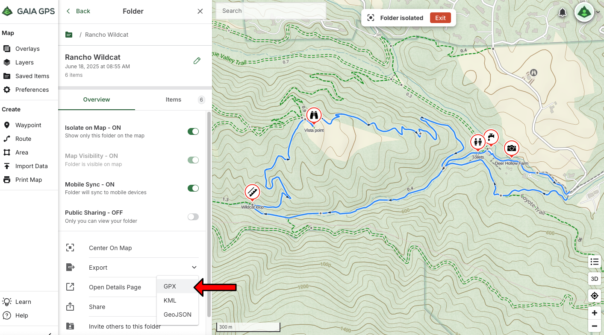

# CoursePointer

A command-line tool that converts GPX routes/tracks and waypoints into Garmin
FIT course files with "course points". This allows your waypoints to appear in
[Up Ahead](https://support.garmin.com/en-US/?faq=lQMibRoY2I5Y4pP8EXgxv7) on
recent Garmin watches and bicycle computers, displaying their 

## Usage example

Suppose you're planning a hiking route on [Gaia GPS](https://gaiagps.com/). In
addition to the route itself, you might have identified several points of
interest that you've saved as "waypoints":

## Development

See [docs/development.md](docs/development.md).
