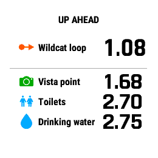

# CoursePointer

A command-line tool that converts GPX routes/tracks and waypoints into Garmin
FIT course files with [course
points](https://support.garmin.com/en-US/?faq=aisqGZTLwH5LvbExSdO6L6). This
lets your waypoints appear in [Up
Ahead](https://support.garmin.com/en-US/?faq=lQMibRoY2I5Y4pP8EXgxv7) on
compatible Garmin watches and bicycle computers, showing the distance
remaining (and on some devices, estimated time) to reach them.

This provides a way to author courses in third-party applications that don't
export to course points, while stil using Up Ahead functionality as though the
course had been created in Garmin Connect.

## Usage example

When planning a hiking route on [Gaia GPS](https://gaiagps.com/), you can put
a route and waypoints together in a Saved Items folder and then export the
entire folder as a GPX file:


Run coursepointer on the GPX download to produce a FIT file:

```
% coursepointer convert rancho-wildcat.gpx
Converted course "Rancho Wildcat" of length 3.03 mi

Processed 5 waypoints, 5 of which were identified as course points:
- Wildcat loop at 1.09 mi along the course
- Vista point at 1.68 mi
- Toilets at 2.70 mi
- Drinking water at 2.74 mi
- Deer Hollow Farm at 2.82 mi

Output is in /Users/mshroyer/Desktop/rancho-wildcat.fit
```

Copy the FIT file to the device over USB, or import it into [Garmin
Connect](https://connect.garmin.com/modern/) and then send it to your device
from the Garmin mobile app.  Then, when navigating the course, your course
points will appear in Up Ahead on compatible devices:



## Installation and running

At the moment this is a source-only distribution, so you'll need a Rust
toolchain to build and run the CLI.  But it is at least published as a crate.
Install a toolchain with [rustup](https://rustup.rs/) and then run:

```
cargo install --locked coursepointer
```

On your command line, run `coursepointer help` for usage information.

You can also clone and build this repository for the very most recent version,
of course.  See [docs/development.md](docs/development.md) for more
information.

## Detailed description

GPX waypoints specify a latitude, longitude, and optionally elevation.
Waypoints can be included in the same GPX file as a route or a track, but that
doesn't mean they're necessarily located *along* the route.

In contrast, the course points in a FIT course file are specifically points on
the course.  In addition to their latitude and longitude, they also specify
the distance at which they appear along the course, used by the Up Ahead
feature to compute distance remaining.

So given a GPX route and a set of waypoints, coursepointer:

1. Identifies which waypoints intercept the route within a configurable
   threshold distance
2. Calculates that point of interception's distance along the total route
3. Exports the route and these course points in FIT format

This amounts to solving the [interception
problem](https://sourceforge.net/p/geographiclib/discussion/1026621/thread/21aaff9f/#8a93)
between waypoints and the geodesic segments comprising the route.  See
[docs/Course Point Distances.pdf](docs/Course%20Point%20Distances.pdf) for
more information about the method used here.

## Wait, can't I just import my GPX into Garmin Connect?

Actually no, and this is a common source of confusion!

Importing a GPX file with a route and waypoints into Garmin Connect's web
application does convert any waypoints within about 35m of the course into
course points.  However, at the time of writing it doesn't compute their
distances, instead setting them to zero.

This leads to surprising behavior when you navigate this course on your
device: Your course points show up at the correct positions on the map, and
may appear in Up Ahead before you begin.  But as soon as you start recording
your course and pass distance zero, they'll all disappear!

This is a longstanding limitation that has been discussed [on
Reddit](https://www.reddit.com/r/Garmin/comments/1ds478x/how_does_up_ahead_actually_work/)
and [in Garmin's
forums](https://forums.garmin.com/outdoor-recreation/outdoor-recreation/f/fenix-7-series/369450/is-garmin-going-to-ever-fix-a-glaring-bug-with-garmin-connect-gpx-course-import-which-results-in-up-ahead-simply-not-working/1765480#1765480).

## Supported route creators

This should work with GPX routes or tracks and waypoints authored in arbitrary
route-planning applications.

However, for routes or tracks exported by [Gaia GPS](https://gaiagps.com/) or
[Ride with GPS](https://ridewithgps.com/), coursepointer additionally attempts
to map the waypoint or POI type (respectively) to a relevant course point type
instead of `generic`, so you'll see a relevant course point icon instead of a
generic pin.  See [docs/point_types.md](docs/point_types.md) for more
information about how point types from these apps are interpreted as course
point types.

Currently, GPX input files must contain exactly one route or track, and zero
or more waypoints.  Routes and tracks are treated identically.

I made this originally with Ride with GPS in mind, but their new [Waypoints
feature](https://support.ridewithgps.com/hc/en-us/articles/36795897776411-Waypoints)
natively supports exporting POIs as FIT course points.  RWGPS Waypoints will
probably be more convenient than using this tool for most users, though
coursepointer does offer more control over things like virtual partner speed
and behavior when passing by POIs multiple times, such as on out-and-back
routes.

## Troubleshooting

TODO

## Development

See [docs/development.md](docs/development.md).

## License

[MIT License](LICENSE.txt)
