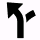

# Course Point Types

The canonical set of course point types is defined in `Profile.xlsx` in the
[Garmin FIT SDK](https://developer.garmin.com/fit/download/), as the
`course_point` enum in the Types tab.  But the real question is how these
behave in practice on devices.

This document's purpose is to identify:

1. What subset of course point types is safe to use across devices.
2. How to map exported waypoints from popular apps like Ride with GPS and Gaia
   GPS to that subset.

## On Garmin apps and devices

Here's how different course points function in Garmin Connect and appear in
"Up Ahead" on a Fenix 7 with software version 21.19, as well as an Edge 1040
with software 27.14.

There are a few different cases to consider: Types listing an icon appear in
Up Ahead with that icon, and also on the course map with a similar but
monochrome icon.  Types marked with (1) are missing entirely from Up Ahead,
but while they lack an icon on the map, the course point's name will appear in
the correct map location.  Finally, types marked with (2) are missing from Up
Ahead but appear on the map with an appropriate icon.

| Type               | Connect | Fenix 7                               | Edge 1040                             |
|--------------------|---------|---------------------------------------|---------------------------------------|
| `generic`          | yes     |          |  |
| `summit`           | yes     |           |  |
| `valley`           | yes     |           |  |
| `water`            | yes     |            |  |
| `food`             | yes     |             |  |
| `danger`           | yes     |           |  |
| `left`             | no      | (1)                                   |  |
| `right`            | no      | (1)                                   |  |
| `straight`         | no      | (1)                                   |  |
| `first_aid`        | yes     |         |  |
| `fourth_category`  | yes     |   |  |
| `third_category`   | yes     |    |  |
| `second_category`  | yes     |   |  |
| `first_category`   | yes     |    |  |
| `hors_category`    | yes     |     |  |
| `sprint`           | yes     |           |  |
| `left_fork`        | no      | (1)                                   |  |
| `right_fork`       | no      | (1)                                   |  |
| `middle_fork`      | no      | (1)                                   |  |
| `slight_left`      | no      | (1)                                   |  |
| `sharp_left`       | no      | (1)                                   |  |
| `slight_right`     | no      | (1)                                   |  |
| `sharp_right`      | no      | (1)                                   |  |
| `u_turn`           | no      | (1)                                   |  |
| `segment_start`    | no      | (2)                                   | (1)                                   |
| `segment_end`      | no      | (2)                                   |  |
| `campsite`         | yes     |         |  |
| `aid_station`      | yes     |       |  |
| `rest_area`        | yes     |         |  |
| `general_distance` | yes     |  |  |
| `service`          | yes     |          |  |
| `energy_gel`       | yes     |        |  |
| `sports_drink`     | yes     |      |  |
| `mile_marker`      | yes     |       |  |
| `checkpoint`       | yes     |       |  |
| `shelter`          | yes     |          |  |
| `meeting_spot`     | yes     |      |  |
| `overlook`         | yes     |         |  |
| `toilet`           | yes     |           |  |
| `shower`           | yes     |           |  |
| `gear`             | yes     |             |  |
| `sharp_curve`      | yes     |       |  |
| `steep_incline`    | yes     |     |  |
| `tunnel`           | yes     |           |  |
| `bridge`           | yes     |           |  |
| `obstacle`         | yes     |         |  |
| `crossing`         | yes     |         |  |
| `store`            | yes     |            |  |
| `transition`       | yes     |       |  |
| `navaid`           | yes     |           |  |
| `transport`        | yes     |        |  |
| `alert`            | yes     |            |  |
| `info`             | yes     |             |  |

Bizarrely, the `shower` course point didn't show up at all my first time
testing this on my Fenix, but then rendered the next time, with the exact same
course file and firmware version.

The Connect column indicates whether the course point type appears when
imported into Garmin Connect, or can be created manually.  As of 2025-06-15,
it's possible to create additional "Obstacle Start" (type number 54) and
"Obstacle End" (type 55) which are absent from the current global
`Profile.xlsx`.

I did encounter some unexpected behavior when importing synthetically
generated courses (which did not correspond to any real trail or road) into
Connect.  Particularly, importing such FIT files containing more than four
course points resulted in *no* course points appearing.  I haven't yet
reproduced this behavior with conversions of "real" courses, however.

## RideWithGPS POIs

Ride with GPS has various POI types.  When these are exported as GPX
waypoints, they will correspond to certain `cmt` and `type` XML attributes.
Thanks to the new (if confusingly named) [Waypoints
feature](https://ridewithgps.com/news/11178-introducing-waypoints), when
exported in a FIT file, they also will correspond to certain FIT course point
types.

This table shows how the different POI types map to GPX and FIT types as of
2025-06-14.  The `cmt` XML attribute used in GPX exports corresponds to the
RWGPS POI type, while the `type` attribute always equals the FIT course point
type.

| Type              | Icon                                                  | GPX cmt attr        | GPX type attr | FIT type      |
|-------------------|-------------------------------------------------------|---------------------|---------------|---------------|
| Information       |              | `generic`           | `generic`     | `generic`     |
| Caution           |                      | `caution`           | `danger`      | `danger`      |
| Hospital          |                    | `hospital`          | `aid_station` | `aid_station` |
| First Aid         |                  | `first_aid`         | `first_aid`   | `first_aid`   |
| Aid Station       |              | `aid_station`       | `aid_station` | `aid_station` |
| Restroom          |                    | `restroom`          | `toilet`      | `toilet`      |
| Shower            |                        | `shower`            | `shower`      | `shower`      |
| Water             |                          | `water`             | `water`       | `water`       |
| Parking           |                      | `parking`           | `service`     | `service`     |
| Gas Station       |              | `gas`               | `service`     | `service`     |
| Transit Center    |        | `transit`           | `transport`   | `transport`   |
| Ferry             |                          | `ferry`             | `transport`   | `transport`   |
| Library           |                      | `library`           | `info`        | `info`        |
| Monument          |                    | `monument`          | `info`        | `info`        |
| Viewpoint         |                  | `viewpoint`         | `overlook`    | `overlook`    |
| Trailhead         |                  | `trailhead`         | `info`        | `info`        |
| Camping           |                      | `camping`           | `campsite`    | `campsite`    |
| Park              |                            | `park`              | `rest_area`   | `rest_area`   |
| Summit            |                        | `summit`            | `summit`      | `summit`      |
| Rest Stop         |                  | `rest_stop`         | `rest_area`   | `rest_area`   |
| Swimming          |                    | `swimming`          | `rest_area`   | `rest_area`   |
| Geocache          |                    | `geocache`          | `info`        | `info`        |
| Food              |                            | `food`              | `food`        | `food`        |
| Bar               |                              | `bar`               | `food`        | `food`        |
| Coffee            |                        | `coffee`            | `food`        | `food`        |
| Winery            |                        | `winery`            | `food`        | `food`        |
| Lodging           |                      | `lodging`           | `shelter`     | `shelter`     |
| Convenience Store |  | `convenience_store` | `store`       | `store`       |
| Shopping          |                    | `shopping`          | `store`       | `store`       |
| ATM               |                              | `atm`               | `service`     | `service`     |
| Bike Shop         |                  | `bike_shop`         | `gear`        | `gear`        |
| Bike Parking      |            | `bike_parking`      | `service`     | `service`     |
| Bike Share        |                | `bikeshare`         | `service`     | `service`     |
| Start             |                          | `start`             | `generic`     | `generic`     |
| Stop              |                            | `stop`              | `generic`     | `generic`     |
| Finish            |                        | `finish`            | `generic`     | `generic`     |
| Segment Start     |          | `segment_start`     | `generic`     | `generic`     |
| Segment End       |              | `segment_end`       | `generic`     | `generic`     |
| Control           |                      | `control`           | `checkpoint`  | `checkpoint`  |

All POI types set `Dot` as `sym` in the GPX export.

The full set of course point types used by Ride with GPS in FIT exports of
custom POIs and Waypoints (setting aside cues) is then:

- `generic`
- `summit`
- `water`
- `food`
- `danger`
- `first_aid`
- `campsite`
- `aid_station`
- `rest_area`
- `service`
- `checkpoint`
- `shelter`
- `overlook`
- `toilet`
- `shower`
- `gear`
- `store`
- `transport`
- `info`

This might represent a safe, conservative set of course point types to use in
FIT exports, as likely Ride with GPS has tested this more thoroughly than I
have.

## Gaia GPS Waypoints

Gaia GPS supports an _enormous_ number of waypoint types, including various
emoji.  But a subset of these, the "Gaia" set, bear semantics that map well
onto the (smaller) set of course point types.

In GPX exports, Gaia GPS indicates the point type by the text in the
waypoint's `sym` sub-element.  These basically, but not precisely, match the
waypoint's type; many have a `-24` suffix, which presumably corresponds to an
icon size.  With others, such as `:gaia-body-of-water:`, the `sym` text is
simplified to `water` for example.

| Type                | Icon                                    | Sym                      |
|---------------------|-----------------------------------------|--------------------------|
| `:gaia-pin:`                 |      | None                     |
| `:gaia-airport:`             |      | `airport-24`             |
| `:gaia-attraction:`          |      | `attraction`             |
| `:gaia-beach:`               |      | `beach`                  |
| `:gaia-bear:`                |      | `bear`                   |
| `:gaia-bicycle:`             |      | `bicycle-24`             |
| `:gaia-binoculars:`          |      | `binoculars`             |
| `:gaia-bird:`                |      | `bird`                   |
| `:gaia-body-of-water:`       |      | `water`                  |
| `:gaia-bridge:`              |      | `bridge`                 |
| `:gaia-building:`            |    | `building-24`            |
| `:gaia-bus:`                 |    | `bus`                    |
| `:gaia-cafe:`                |    | `cafe-24`                |
| `:gaia-cairn:`               |    | `cairn`                  |
| `:gaia-camera:`              |    | `camera-24`              |
| `:gaia-campsite:`            |    | `campsite-24`            |
| `:gaia-canoe:`               |    | `canoe`                  |
| `:gaia-car:`                 |    | `car-24`                 |
| `:gaia-cave:`                |    | `cave`                   |
| `:gaia-cemetery:`            |    | `cemetery-24`            |
| `:gaia-chemist:`             |    | `chemist-24`             |
| `:gaia-circle:`              |    | `circle-24`              |
| `:gaia-city:`                |    | `city-24`                |
| `:gaia-cliff:`               |    | `cliff`                  |
| `:gaia-climbing:`            |    | `climbing`               |
| `:gaia-dam:`                 |    | `dam-24`                 |
| `:gaia-danger:`              |    | `danger-24`              |
| `:gaia-deer:`                |    | `deer`                   |
| `:gaia-disability:`          |    | `disability-24`          |
| `:gaia-disc-golf:`           |    | `disc-golf`              |
| `:gaia-dog-park:`            |    | `dog-park-24`            |
| `:gaia-electric:`            |    | `electric`               |
| `:gaia-elk:`                 |    | `elk`                    |
| `:gaia-emergency-telephone:` |    | `emergency-telephone-24` |
| `:gaia-fast-food:`           |    | `fast-food-24`           |
| `:gaia-fence:`               |    | `fence`                  |
| `:gaia-fire-lookout:`        |    | `fire-lookout`           |
| `:gaia-fire-station:`        |    | `fire-station-24`        |
| `:gaia-fish:`                |    | `fish`                   |
| `:gaia-forest:`              |    | `forest`                 |
| `:gaia-fuel:`                |    | `fuel-24`                |
| `:gaia-garden:`              |    | `garden-24`              |
| `:gaia-gate:`                |    | `gate`                   |
| `:gaia-geyser:`              |    | `geyser`                 |
| `:gaia-ghost-town:`          |    | `ghost-town`             |
| `:gaia-golf:`                |    | `golf-24`                |
| `:gaia-grass:`               |    | `grass`                  |
| `:gaia-ground-blind:`        |    | `ground-blind`           |
| `:gaia-harbor:`              |    | `harbor-24`              |
| `:gaia-heart:`               |    | `heart-24`               |
| `:gaia-helipad:`             |    | `helipad`                |
| `:gaia-heliport:`            |    | `heliport-24`            |
| `:gaia-horse:`               |    | `horse`                  |
| `:gaia-hospital:`            |    | `hospital-24`            |
| `:gaia-hotspring:`           |    | `hotspring`              |
| `:gaia-information:`         |    | `information`            |
| `:gaia-known-route:`         |    | `known-route`            |
| `:gaia-lake:`                |    | `lake`                   |
| `:gaia-lighthouse:`          |    | `lighthouse-24`          |
| `:gaia-lodging:`             |    | `lodging-24`             |
| `:gaia-logging:`             |    | `logging-24`             |
| `:gaia-market:`              |    | `market`                 |
| `:gaia-marsh:`               |    | `marsh`                  |
| `:gaia-mine:`                |    | `mine`                   |
| `:gaia-minefield:`           |    | `minefield-24`           |
| `:gaia-mobilephone:`         |    | `mobilephone-24`         |
| `:gaia-moose:`               |    | `moose`                  |
| `:gaia-mud:`                 |    | `mud`                    |
| `:gaia-museum:`              |    | `museum`                 |
| `:gaia-mushroom:`            |    | `mushroom`               |
| `:gaia-natural-spring:`      |    | `natural-spring`         |
| `:gaia-no-admittance-1:`     |    | `no-admittance-1`        |
| `:gaia-no-admittance-2:`     |    | `no-admittance-2`        |
| `:gaia-number-0:`            |    | `number-0`               |
| `:gaia-number-1:`            |    | `number-1`               |
| `:gaia-number-2:`            |    | `number-2`               |
| `:gaia-number-3:`            |    | `number-3`               |
| `:gaia-number-4:`            |    | `number-4`               |
| `:gaia-number-5:`            |    | `number-5`               |
| `:gaia-number-6:`            |    | `number-6`               |
| `:gaia-number-7:`            |    | `number-7`               |
| `:gaia-number-8:`            |    | `number-8`               |
| `:gaia-number-9:`            |    | `number-9`               |
| `:gaia-off-road:`            |    | `off-road`               |
| `:gaia-oil-well:`            |    | `oil-well-24`            |
| `:gaia-park:`                |    | `park-24`                |
| `:gaia-parking:`             |    | `parking-24`             |
| `:gaia-peak:`                |    | `peak`                   |
| `:gaia-petroglyph:`          |    | `petroglyph`             |
| `:gaia-picnic:`              |    | `picnic`                 |
| `:gaia-pitch:`               |    | `pitch-24`               |
| `:gaia-playground:`          |    | `playground-24`          |
| `:gaia-police:`              |    | `police`                 |
| `:gaia-polling-place:`       |    | `polling-place-24`       |
| `:gaia-potable-water:`       |    | `potable-water`          |
| `:gaia-prison:`              |    | `prison-24`              |
| `:gaia-rail:`                |    | `rail-24`                |
| `:gaia-railroad:`            |    | `railroad`               |
| `:gaia-ranger-station:`      |    | `ranger-station`         |
| `:gaia-reef:`                |    | `reef`                   |
| `:gaia-restaurant:`          |  | `restaurant-24`          |
| `:gaia-resupply:`            |  | `resupply`               |
| `:gaia-ruins:`               |  | `ruins`                  |
| `:gaia-rv-park:`             |  | `rv-park`                |
| `:gaia-saddle:`              |  | `saddle`                 |
| `:gaia-sand-dune:`           |  | `sand-dune`              |
| `:gaia-scat:`                |  | `scat`                   |
| `:gaia-scrub:`               |  | `scrub`                  |
| `:gaia-shelter:`             |  | `shelter`                |
| `:gaia-shower:`              |  | `shower`                 |
| `:gaia-skiing:`              |  | `skiing-24`              |
| `:gaia-snowflake:`           |  | `snowflake`              |
| `:gaia-snowmobile:`          |  | `snowmobile`             |
| `:gaia-square:`              |  | `square-24`              |
| `:gaia-star:`                |  | `star-24`                |
| `:gaia-steps:`               |  | `steps`                  |
| `:gaia-stone:`               |  | `stone`                  |
| `:gaia-suitcase:`            |  | `suitcase-24`            |
| `:gaia-swimming:`            |  | `swimming-24`            |
| `:gaia-toilets:`             |  | `toilets-24`             |
| `:gaia-track-deer:`          |  | `track-deer`             |
| `:gaia-track-dog:`           |  | `track-dog`              |
| `:gaia-trail-camera:`        |  | `trail-camera`           |
| `:gaia-trailhead:`           |  | `trailhead`              |
| `:gaia-trash:`               |  | `trash`                  |
| `:gaia-tree-fall:`           |  | `tree-fall`              |
| `:gaia-tree-stand:`          |  | `tree-stand`             |
| `:gaia-triangle:`            |  | `triangle-24`            |
| `:gaia-turkey:`              |  | `turkey`                 |
| `:gaia-volcano:`             |  | `volcano`                |
| `:gaia-water:`               |  | `water-24`               |
| `:gaia-waterfall:`           |  | `waterfall`              |
| `:gaia-wetland:`             |  | `wetland-24`             |
| `:gaia-wood:`                |  | `wood`                   |
