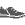

# Course Point Types

The canonical set of course point types is defined in `Profile.xlsx` in the
[Garmin FIT SDK](https://developer.garmin.com/fit/download/), as the
`course_point` enum in the Types tab.  But the real question is how these
behave in practice on devices.

Here's how different course points appear in "Up Ahead" on a Fenix 7 with
software version 21.19.  There are a few different cases to consider.  Types
listing an icon appear in Up Ahead with that icon, and also on the course map
with a similar but monochrome icon.  Types marked with (1) are missing
entirely from Up Ahead, but while they lack an icon on the map, the course
point's name will appear in the correct map location.  Finally, types marked
with (2) are missing from Up Ahead but appear on the map with an appropriate
icon.

| Type            | Fenix 7                                    |
|-----------------|--------------------------------------------|
| Generic         |          |
| Summit          |           |
| Valley          |           |
| Water           |            |
| Food            |             |
| Danger          |           |
| Left            | (1)                                        |
| Right           | (1)                                        |
| Straight        | (1)                                        |
| FirstAid        |         |
| FourthCategory  |   |
| ThirdCategory   |    |
| SecondCategory  |   |
| FirstCategory   |    |
| HorsCategory    |     |
| Sprint          |           |
| LeftFork        | (1)                                        |
| RightFork       | (1)                                        |
| MiddleFork      | (1)                                        |
| SlightLeft      | (1)                                        |
| SharpLeft       | (1)                                        |
| SlightRight     | (1)                                        |
| SharpRight      | (1)                                        |
| UTurn           | (1)                                        |
| SegmentStart    | (2)                                        |
| SegmentEnd      | (2)                                        |
| Campsite        |         |
| AidStation      |       |
| RestArea        |         |
| GeneralDistance |  |
| Service         |          |
| EnergyGel       |        |
| SportsDrink     |      |
| MileMarker      |       |
| Checkpoint      |       |
| Shelter         |          |
| MeetingSpot     |      |
| Overlook        |         |
| Toilet          |           |
| Shower          | (2)                                        |
| Gear            |             |
| SharpCurve      |       |
| SteepIncline    |     |
| Tunnel          |           |
| Bridge          |           |
| Obstacle        |         |
| Crossing        |         |
| Store           |            |
| Transition      |       |
| Navaid          |           |
| Transport       |        |
| Alert           |            |
| Info            |             |

