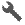

# Course Point Types

The canonical set of course point types is defined in `Profile.xlsx` in the
[Garmin FIT SDK](https://developer.garmin.com/fit/download/), as the
`course_point` type.  But that just gives us a list of possible types to use.
The real question is, how do these point types behave when loaded onto Garmin
devices we care about?

Here are how different course point types appear in "Up Ahead" on a Fenix 7
running software version 21.19.  There are a few different cases to consider.
Types with an icon listed appear in Up Ahead with the designated icon, and
also on the course map with a similar but monochrome icon.  Types marked with
(1) are missing from Up Ahead, but while they also lack an icon on the map,
the course point's name will appear in the appropriate location on the course
map.  Finally, types marked with (2) are missing from Up Ahead but appear on
the map with an appropriate icon.

| Type            | Fenix 7                               |
|-----------------|---------------------------------------|
| Generic         |          |
| Summit          |           |
| Valley          |           |
| Water           |            |
| Food            |             |
| Danger          |           |
| Left            | (1)                                   |
| Right           | (1)                                   |
| Straight        | (1)                                   |
| FirstAid        |         |
| FourthCategory  |   |
| ThirdCategory   |    |
| SecondCategory  |   |
| FirstCategory   |    |
| HorsCategory    |     |
| Sprint          |           |
| LeftFork        | (1)                                   |
| RightFork       | (1)                                   |
| MiddleFork      | (1)                                   |
| SlightLeft      | (1)                                   |
| SharpLeft       | (1)                                   |
| SlightRight     | (1)                                   |
| SharpRight      | (1)                                   |
| UTurn           | (1)                                   |
| SegmentStart    | (2)                                   |
| SegmentEnd      | (2)                                   |
| Campsite        |         |
| AidStation      |       |
| RestArea        |         |
| GeneralDistance |  |
| Service         |          |
| EnergyGel       |        |
| SportsDrink     |      |
| MileMarker      |       |
| Checkpoint      |       |
| Shelter         |          |
| MeetingSpot     |      |
| Overlook        |         |
| Toilet          |           |
| Shower          | (2)                                   |
| Gear            |             |
| SharpCurve      |       |
| SteepIncline    |     |
| Tunnel          |           |
| Bridge          |           |
| Obstacle        |         |
| Crossing        |         |
| Store           |            |
| Transition      |       |
| Navaid          |           |
| Transport       |        |
| Alert           |            |
| Info            |             |

